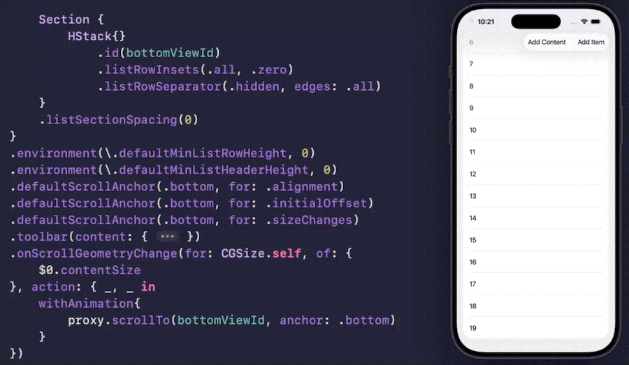

# SwiftUI_AutoScrollDemo
Three different approaches to Automatically Scroll to the Bottom Of ScrollView. 
- Initial Offset
- On ScrollView Items change
- On Content of an Item Change

For more details, please refer to my article [SwiftUI: 2.5 RELIABLE Ways to Automatically Scroll to the Bottom Of ScrollView]()

